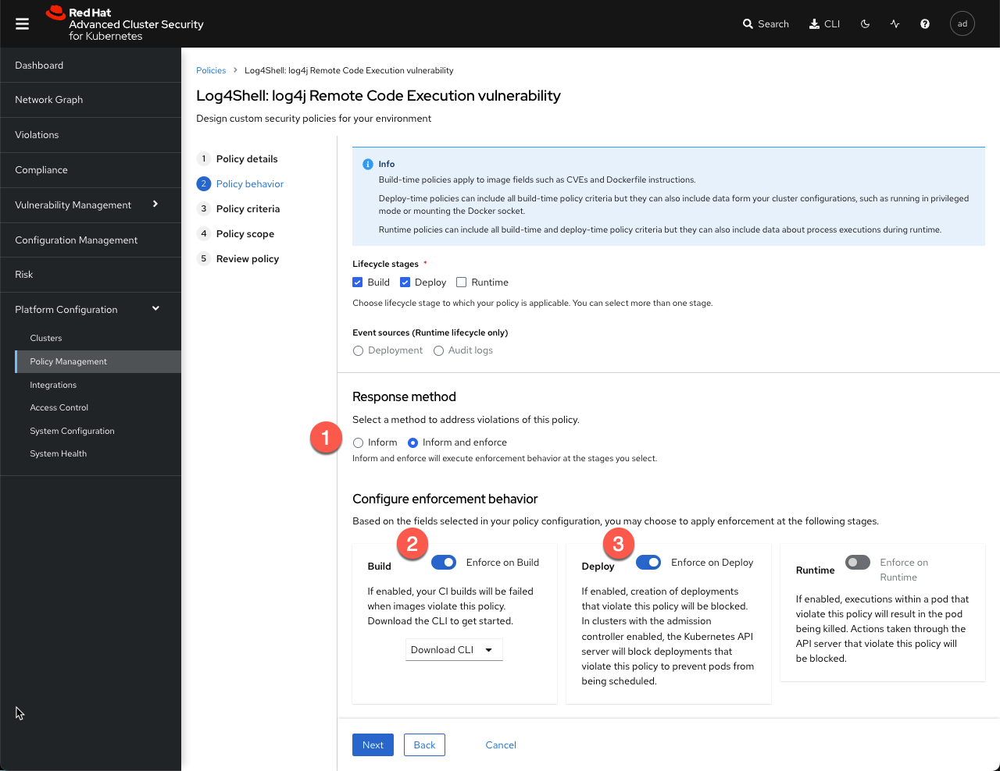

Sample app to illustrate log4j vulnerability detection in RHACS.

# Deploy

Create app in `log4shell` namespace:

```bash
oc apply -k base
```

# Demo

View violation of "Log4Shell: log4j Remote Code Execution vulnerability" in the Violations menu.

Modify the policy response method from "Inform" to "Inform and enforce" during the Build and Deploy lifecycle stages.



To avoid an outage, running applications will not be automatically terminated by a Deploy lifecycle policy. 

Remove and redeploy the application.

```bash
oc delete -k base

oc apply -k base

oc describe deployment log4shell -n log4shell | tail

  Available      True    MinimumReplicasAvailable
  Progressing    True    NewReplicaSetAvailable
OldReplicaSets:  <none>
NewReplicaSet:   log4shell-5fc55944f6 (0/0 replicas created)
Events:
  Type     Reason                Age   From                   Message
  ----     ------                ----  ----                   -------
  Normal   ScalingReplicaSet     30m   deployment-controller  Scaled up replica set log4shell-5fc55944f6 to 1
  Warning  StackRox enforcement  30m   stackrox/sensor        Deployment violated StackRox policy "Log4Shell: log4j Remote Code Execution vulnerability" and was scaled down
  Normal   ScalingReplicaSet     30m   deployment-controller  Scaled down replica set log4shell-5fc55944f6 to 0
```

Vulnerability will be detected and automatically scaled to zero at deployment time.


# Background

App was created as follows:

```bash
oc new-app \
    --name log4shell \
    --image quay.io/tjungbau/log4shell-app:latest \
    --dry-run \
    -o yaml > base/application.yaml
```

Further modify due to https://issues.redhat.com/browse/OCPBUGSM-22430 & https://issues.redhat.com/browse/ROX-7531 thwarting the policy:

* Comment out the imagestream resource
* Remove the image trigger annotation on the deployment
* Replace the empty image value in the deployment


